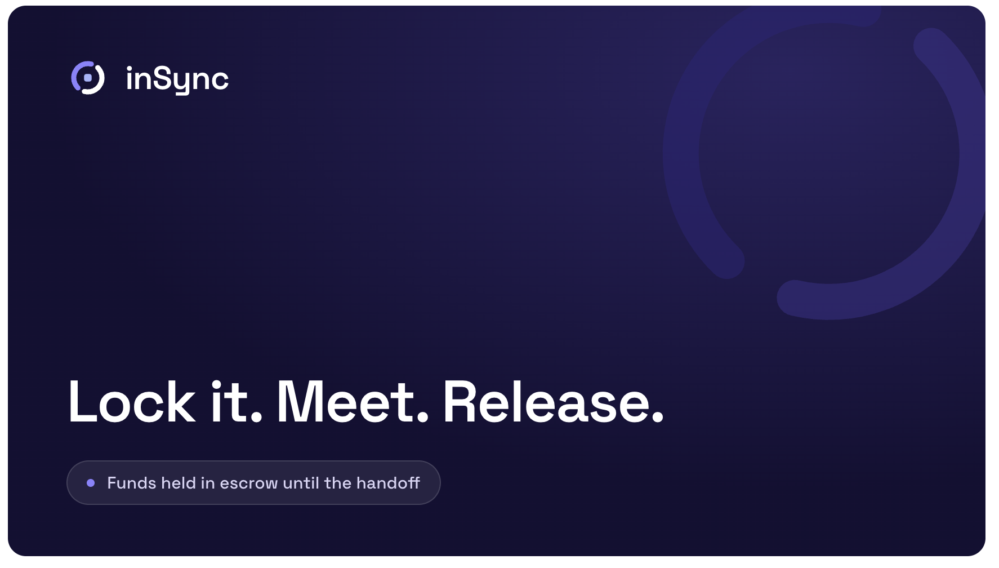

# inSync



**Trustless in-person escrow for buying from a stranger on Marketplace/Craigslist —
funds release only at the physical handoff.**

The seller can *see the buyer's money is real and locked before anyone travels*
(this kills flaking, the #1 Marketplace pain); at the meet the buyer scans the
seller's one-time QR and funds settle **instantly and finally — no bank, no
chargeback**.

## Why this needs crypto

Two strangers with no shared bank, no cash changing hands, want one thing: a
deal that is **provably funded before they travel** and **final once it's done**.
That exact combination is impossible with traditional rails:

- **Provable commitment.** The seller verifies on-chain that the buyer's funds
  are escrowed *before* agreeing to meet. No "I'll bring cash, promise."
- **Final settlement, no chargebacks.** A card or PayPal payment can be clawed
  back days later; an on-chain release is irreversible the instant it happens.
- **No trusted intermediary.** No platform holding the money, no dispute desk,
  no KYC'd shared account between people who just met.

inSync is **dispute-free by construction**: every outcome is a deterministic
on-chain rule or a mutual in-person signature — never a judge, jury, or AI.

## Architecture

```
                         ┌──────────────────────────────┐
        email login      │        apps/web (Next.js)     │   mobile-first UI:
   ┌──────────────────►  │ Browse·Sell·Buy·Deal·Listings │   list / fund / meet
   │                     └───────┬───────────────┬───────┘
   │                             │ imports        │ reads/writes via viem
   │   packages/ (standalone npm workspaces)      │
   │   ┌──────────┬───────────┬──────────┬────────┴─────────┐
   │   │  auth    │  funding  │   qr     │   datastreams     │
   │  Dynamic    Blink     QR handshake  Chainlink Data Streams
   │  embedded   one-tap   (in-person    (price-lock for
   │  wallets    USDC fund   release)      volatile tokens)
   │   └──────────┴───────────┴──────────┴───────────────────┘
   │                             │ all share @handoff/contracts-abi
   │                             ▼
   │                  ┌────────────────────────┐        ┌─────────────────────┐
   └───── Dynamic ───►│  contracts/ (Solidity) │◄───────│  cre/ (Chainlink CRE)│
                      │  Escrow · Reputation   │  reclaimExpired()  workflow:  │
                      │  IVerifierProxy        │  on-chain   orchestration +   │
                      └───────────┬────────────┘  state      auto-refund keeper│
                                  │ emits events  change   └──────────┬────────┘
                                  ▼                                    │ POST /notify
                      ┌────────────────────────┐                      ▼
                      │  backend/ (Fastify+sqlite)  indexer + API ◄────┘
                      │  GET /deals /listings · POST /notify           │
                      └────────────────────────┘
```

- **`contracts/`** — `Escrow.sol` (the state machine) + `Reputation.sol`
  (on-chain outcome tally, written only by the escrow). 68 Foundry tests.
- **`packages/*`** — independent `@handoff/*` npm workspaces consumed by the web
  app: `auth` (Dynamic), `funding` (Blink), `qr` (handshake), `datastreams`
  (Chainlink), `contracts-abi` (the frozen ABI + address helpers).
- **`apps/web/`** — Next.js 14 mobile-first app. Imports the packages above.
- **`backend/`** — Fastify + better-sqlite3 event indexer and read API.
- **`cre/`** — the Chainlink CRE workflow: the escrow's orchestration brain.

See **[SPEC.md](./SPEC.md)** for the full design (frozen interfaces, event
signatures, and the per-module contract).

## The commitment-deposit (cancellation) model

The buyer's **item price is always safe**. The only money ever at risk is a
small, seller-set **deposit** (earnest money, `depositBps` per listing), and only
when the buyer flakes *after the seller has already shown up*. At funding the
buyer locks `price + deposit`; the outcome is a deterministic rule:

| Trigger | Item price | Deposit |
|---|---|---|
| `confirmReceipt` — buyer got the item (success) | → seller | → back to buyer |
| `agreeCancel` — seller co-signs a cancel | → buyer | → buyer |
| `buyerCancel` **before** the free-cancel window | → buyer | → buyer |
| `buyerCancel` after free window **and** seller checked in | → buyer | **→ seller** (buyer flaked on a present seller) |
| `buyerCancel` after free window, seller **not** checked in | → buyer | → buyer (seller no-show protection) |
| `reclaimExpired` after expiry, seller checked in | → buyer | → seller |
| `reclaimExpired` after expiry, seller not checked in | → buyer | → buyer |

For a volatile pay-token, "price" and "deposit" are valued in USD via Chainlink
Data Streams at the moment of the call, with surplus returned to the buyer.

## Live deployment (Base Sepolia · chainId 84532)

| Contract | Address |
|---|---|
| Escrow | [`0xb6c4C1B841C558280783979BA76009a4F3024410`](https://sepolia.basescan.org/address/0xb6c4C1B841C558280783979BA76009a4F3024410) |
| USDC (test) | [`0xf4E59C1c79A6fF313E64b9B9398A03Da60Ba8Ff8`](https://sepolia.basescan.org/address/0xf4E59C1c79A6fF313E64b9B9398A03Da60Ba8Ff8) |
| MockVerifier | [`0xABe64efA8ffF93C129Dad6Cc3F1E53F50a7EecBC`](https://sepolia.basescan.org/address/0xABe64efA8ffF93C129Dad6Cc3F1E53F50a7EecBC) |

This Escrow was deployed with constructor args `(stableToken=USDC, verifierProxy=MockVerifier,
reputation=address(0))` — the reputation tally is optional and is not wired into this
particular deployment.

### Verify the contract on Basescan

Verifying the Escrow source lets anyone read the exact rules that govern their escrowed
funds — this is what backs the "trustless, no one can touch it" claim. Easiest path:

```bash
cd contracts
forge verify-contract 0xb6c4C1B841C558280783979BA76009a4F3024410 src/Escrow.sol:Escrow \
  --chain base-sepolia --watch --verifier etherscan \
  --etherscan-api-key <BASESCAN_API_KEY> \
  --constructor-args $(cast abi-encode "constructor(address,address,address)" \
    0xf4E59C1c79A6fF313E64b9B9398A03Da60Ba8Ff8 \
    0xABe64efA8ffF93C129Dad6Cc3F1E53F50a7EecBC \
    0x0000000000000000000000000000000000000000)
```

Manual "Verify & Publish" on sepolia.basescan.org — Compiler: `v0.8.24+commit.e11b9ed9`,
Optimization: `Yes`, Runs: `200`, EVM version: `cancun`, License: `MIT`, ABI-encoded
constructor args (no `0x`): `000000000000000000000000f4e59c1c79a6ff313e64b9b9398a03da60ba8ff8000000000000000000000000abe64efa8fff93c129dad6cc3f1e53f50a7eecbc0000000000000000000000000000000000000000000000000000000000000000`

## Sponsors used

Single source link per sponsor (the primary integration point):

- **Chainlink** — [`cre/src/workflow.ts`](https://github.com/cryptomachia/insync/blob/main/cre/src/workflow.ts) — the CRE workflow (anchor) sweeps past-expiry deals on a cron and submits `reclaimExpired(dealId, report)` on-chain. Data Streams price-lock: signed report fetched in [`packages/datastreams/src/index.ts#L114-L158`](https://github.com/cryptomachia/insync/blob/main/packages/datastreams/src/index.ts#L114-L158) and verified on-chain at [`contracts/src/Escrow.sol#L503-L508`](https://github.com/cryptomachia/insync/blob/main/contracts/src/Escrow.sol#L503-L508).
- **Dynamic** — [`packages/auth/src/dynamic.tsx`](https://github.com/cryptomachia/insync/blob/main/packages/auth/src/dynamic.tsx) — embedded wallets with email login (no seed phrase), connect-only mode, Base Sepolia registered.
- **Blink** — [`packages/funding/src/index.tsx#L103-L131`](https://github.com/cryptomachia/insync/blob/main/packages/funding/src/index.tsx#L103-L131) — one-tap USDC deposit via the Blink SDK; merchant signer (ECDSA P-256) at [`apps/web/app/api/sign-payment/route.ts`](https://github.com/cryptomachia/insync/blob/main/apps/web/app/api/sign-payment/route.ts).

## Test status

- **76 contract tests** (Foundry): happy path, every §4 cancellation branch,
  volatile-token release through a mock verifier, reentrancy, access control.
- **Script-level on-chain e2e** (`e2e/scripts/contract-e2e.ts`, viem): every §4
  outcome plus the volatile Data Streams release, run directly against the chain.
- **Full UI e2e** (Playwright): the happy path (login → list → fund → check-in →
  scan → released) and a cancel branch, booting `apps/web` in mock mode.

```bash
make test          # forge tests + e2e
make e2e-contract  # ~5s: every §4 outcome + the volatile Data Streams release
make e2e-ui        # Playwright: happy path + a cancel branch
```

## How to run

You need [Foundry](https://book.getfoundry.sh/getting-started/installation)
(`forge`/`anvil`/`cast`) and Node ≥ 20.

### Local (mock mode — no third-party accounts)

```bash
cp .env.example .env     # MOCK=true by default; no real keys needed
make install             # deps for contracts + packages + apps + backend/cre/e2e
make dev                 # anvil + deploy + backend + web + Chainlink CRE local keeper
```

`make dev` brings up the whole stack and prints the URLs:

```
web      http://127.0.0.1:3000     # the app (mobile-first; open in a phone-sized window)
backend  http://127.0.0.1:8787     # indexer + API
rpc      http://127.0.0.1:8545     # local anvil chain (id 31337)
```

In mock mode you're auto-logged-in (Dynamic mock), funding does a real on-chain
USDC approve + `fund` on anvil (Blink mock), and the QR step has a paste
fallback for desktop. **Ctrl-C** tears the stack down.

### Live (Base Sepolia + real sponsors)

Drop real keys into `.env` (see `.env.example` for every var), set
`MOCK=false` / `NEXT_PUBLIC_MOCK=false`, point `*_ADDRESS` at the deployed
contracts above, and re-run. You can flip sponsors on one at a time. Exact
steps: [`e2e/CHECKLIST.md`](./e2e/CHECKLIST.md).

### Run the live build locally (named processes)

The two long-running services name themselves (`insync-backend` / `insync-web`)
so they're easy to spot in Activity Monitor / `ps`:

```bash
# backend — indexer + API on :8787 (sources .env so the indexer runs)
cd backend && set -a && . ./.env && set +a && npm run start

# web — production build on :3100 (custom server → process is "insync-web")
cd apps/web && npm run build && npm run serve
```

The indexer backfills lifecycle events from the contract's deploy block
(`INDEXER_FROM_BLOCK` in `.env`) in ≤45k-block chunks, so public RPCs that cap
`eth_getLogs` work out of the box. Open **http://localhost:3100**.

A fresh email wallet holds no USDC, so funding auto-tops-up from a **test-USDC
faucet** (`POST /faucet`) that mints the test token to the buyer (signed by the
deployer key in gitignored `backend/.env`), then runs approve + fund. The buyer
still needs a little Base Sepolia ETH for gas. (Blink one-tap funding is behind
`NEXT_PUBLIC_ENABLE_BLINK`; off by default since its hosted browser SDK can't be
bundled.)

### Common targets

| Target | What it does |
|---|---|
| `make dev` | Full local stack (anvil + deploy + backend + web + CRE keeper). |
| `make build` | `forge build` + all JS workspaces. |
| `make test` | Foundry tests + e2e. |
| `make anvil-bg` / `make deploy` | Start anvil / deploy contracts + write all `.env` files. |
| `make down` / `make clean` | Stop background anvil / remove artifacts + local env files. |
| `make help` | List every target. |

## The demo

The 3-path live demo (happy · no-show CRE reclaim · volatile Data Streams) with
click-by-click steps is in **[DEMO.md](./DEMO.md)**. The integration order is in
[`e2e/CHECKLIST.md`](./e2e/CHECKLIST.md).

## Known limitations

- **On-chain verifier is a `MockVerifier`.** The live Base Sepolia deployment
  uses `MockVerifier` for Data Streams report verification, not Chainlink's real
  on-chain Verifier proxy. The report-fetch + on-chain-verify path is exercised
  end-to-end; swapping in the production verifier proxy is an address change.
- **CRE runs as a local keeper.** A full live CRE DON deployment needs a CRE
  account; the bundled keeper (`cre/`) reproduces the workflow's logic and
  submits the real `reclaimExpired` transaction locally / on Base Sepolia.
- **Blink uses the hosted passkey/signer flow.** Live funding depends on Blink's
  hosted passkey flow and a server-side merchant signer
  (`apps/web/app/api/sign-payment`); mock mode bypasses it with a direct
  on-chain approve + `fund`.
- **Test USDC.** The Base Sepolia USDC above is a test token for the demo, not
  Circle's canonical testnet USDC.
- **Withdraw/relist is off-chain.** A seller withdrawing a listing flips an
  off-chain flag (hidden from browse + a warning on the buy page); the escrow has
  no seller `cancelListing`, so a true on-chain delist is a small contract
  addition + redeploy.

> Everything builds and the full e2e runs offline with `MOCK=true`. Live sponsor
> infrastructure activates by dropping real keys into `.env`.
